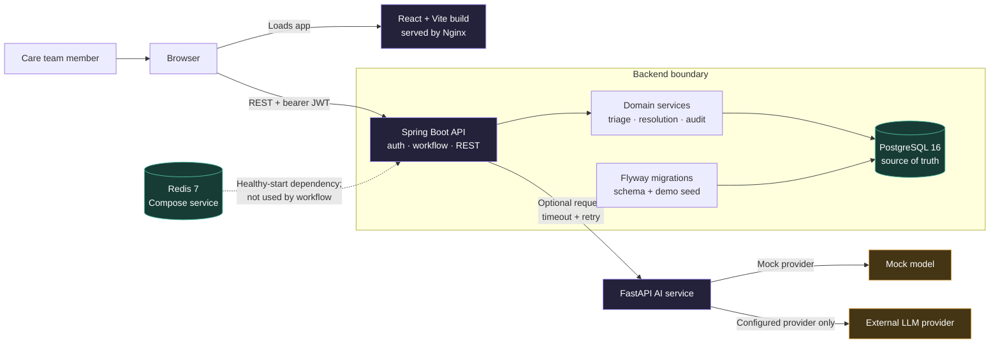
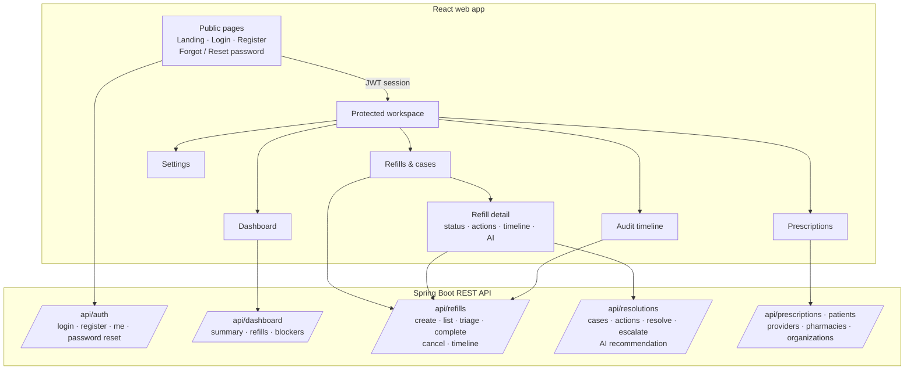
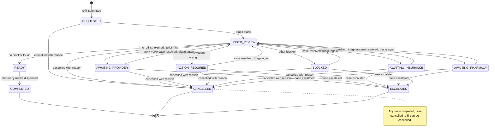
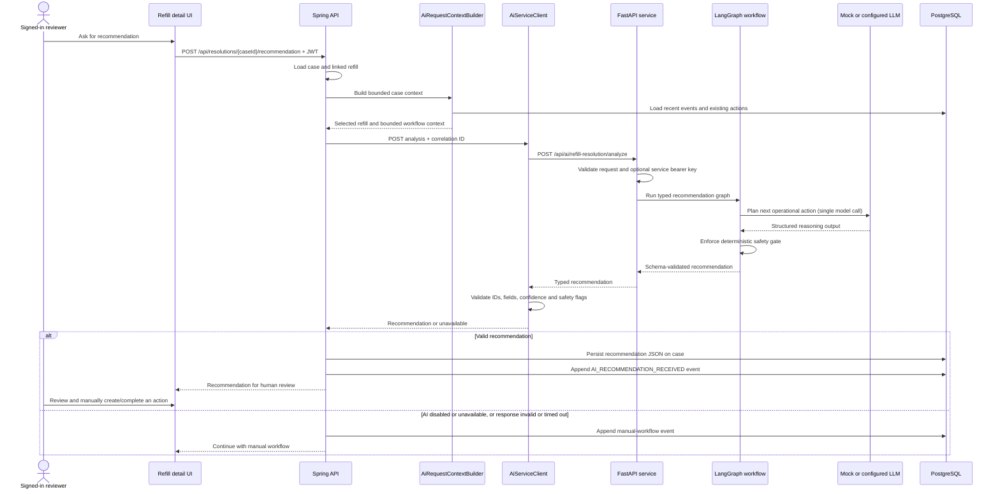
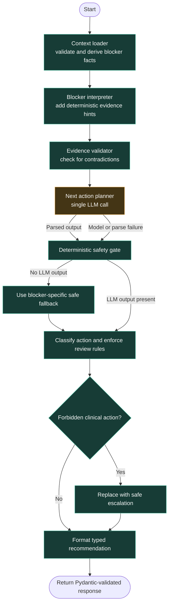
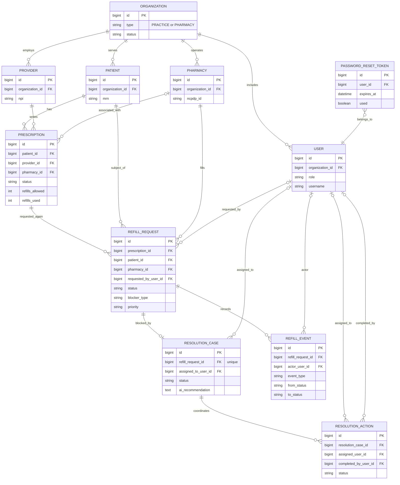

<div align="center">
  

  <h1>Zeno</h1>

  <p><strong>Refills, back on track.</strong></p>

  <p>A calmer way for care teams to untangle blocked prescription refills,<br/>coordinate the next step, and keep every handoff visible.</p>

  <p>
    
    
    
    
  </p>

  <p>
    <a href="#-overview">Overview</a> ·
    <a href="#-how-it-works">How it works</a> ·
    <a href="#architecture-diagrams">Architecture</a> ·
    <a href="#-tech-stack">Tech stack</a> ·
    <a href="#-get-started">Get started</a> ·
    <a href="#-project-map">Project map</a> ·
    <a href="docs/architecture/ai.md">AI architecture</a>
  </p>
</div>

---

## 🎯 Overview

Prescription refills get stuck — between pharmacies, practices, and providers — and when they do, patients wait. Zeno gives care teams **one shared place** to see what's blocked, who owns the next move, and exactly what happened along the way.

No more inbox archaeology. No more phone tag. Just clear next steps.

> Zeno is a B2B refill coordination platform in active development. Workflow rules live deterministically in the backend. AI assists with explanations and operational suggestions — **people stay in charge of every decision.**

---

## ✨ What you can do

| Capability | What it gives you |
|---|---|
| **Queue at a glance** | Scan refill volume, urgent cases, and active blockers from a unified dashboard |
| **Move cases forward** | Triage requests, review status, and coordinate resolution actions in one place |
| **Full prescription context** | See prescription details alongside the refill that needs attention — no tab-switching |
| **Complete audit trail** | Follow a timeline of every workflow event and team handoff |
| **AI-assisted recommendations** | Get an explanation of blockers with cited context and a suggested next step, on demand |
| **Role-based access** | Sign in as a provider, practice staff, pharmacist, or administrator — each with the right view |

---

## ⚙️ How it works

```text
 Refill request arrives
         │
         ▼
 ┌───────────────────────────────┐
 │   Deterministic triage        │  ← Spring Boot validates prescription rules
 └───────────────────────────────┘
         │
    ┌────┴─────────────────────────────┐
    │                                  │
    ▼                                  ▼
 Ready to dispense             Blocker detected
                                       │
                                       ▼
                            Resolution case created
                            Action owner assigned
                                       │
                                       ▼
                          ┌────────────────────────┐
                          │  AI recommendation      │  ← Optional, on demand
                          │  (LangGraph workflow)   │
                          └────────────────────────┘
                                       │
                                       ▼
                            Human reviews & acts
                            Outcome recorded
```

### The AI layer in detail

The AI service is a **bounded advisory assistant**, not the workflow engine.

```text
RefillDetail → Spring Boot → resolution case
                           → FastAPI (apps/ai) → LangGraph graph
                                                  ├── Load context
                                                  ├── Interpret blocker
                                                  ├── Validate evidence
                                                  ├── Plan next step   ← only node that calls the model
                                                  └── Safety gate
                           ← Pydantic-validated recommendation
                           → Audit event stored
```

Key safety constraints:

- The AI service has **no database connection** and cannot mutate any refill state
- It cannot approve, deny, or make any clinical decision
- Unknown actions **fail closed** through the safety gate
- Clinical override actions are **forbidden**
- If the AI service is unavailable, the deterministic workflow continues uninterrupted
- The `:free` OpenRouter endpoint is restricted to `ENVIRONMENT=development` — never send live patient records to it

---

## 🗺 Architecture diagrams

These diagrams are Mermaid source blocks in the README, so compatible Markdown viewers render them right here as diagrams. Open the README in a viewer with diagram canvas controls to pan, zoom, and fit a diagram. The source stays editable alongside the project overview.

### 1 · System map and runtime boundaries



**How to read it:** Nginx serves the web build, and the browser calls the API directly using `VITE_API_BASE_URL`. Spring owns authentication, workflow transitions, and persistence. PostgreSQL is the source of truth. AI receives an on-demand request from Spring and returns a recommendation. Compose starts Redis and waits for it before starting the API, but the current application workflow does not read or write Redis.

### 2 · Web pages and API surface



Routes live in `apps/web/src/App.tsx`; workspace navigation is in `AppLayout.tsx`. The active refill API adapter is `services/api/zenoApi.ts`. All API routes require a bearer token except the explicitly public auth, health, and API documentation routes.

### 3 · Refill lifecycle and deterministic triage



`RefillWorkflowService` checks prescription expiry, remaining refills, prior authorization, then required fields. A blocker maps to a waiting status and creates a resolution case plus an initial suggested action. A clear refill becomes `READY`; completion is separate. Resolving a case returns the refill to review so the backend can triage it again.

### 4 · Refill request sequence and audit trail

```mermaid
sequenceDiagram
    actor Staff as Pharmacy or practice staff
    participant UI as Refill workspace
    participant API as Spring API
    participant Auth as JWT filter
    participant Flow as RefillWorkflowService
    participant Case as ResolutionCaseService
    participant DB as PostgreSQL

    Staff->>UI: Submit refill request
    UI->>API: POST /api/refills + bearer token
    API->>Auth: Validate token and attach identity claims
    Auth-->>API: Authenticated principal
    API->>DB: Load prescription and related records
    API->>DB: Save REQUESTED refill + REFILL_REQUESTED event
    API-->>UI: New refill

    Staff->>UI: Start triage
    UI->>API: POST /api/refills/{id}/triage
    API->>Auth: Validate bearer token
    API->>Flow: Triage refill with authenticated actor
    Flow->>DB: Load refill and prescription
    Flow->>DB: Save UNDER_REVIEW + status event
    Flow->>Flow: Apply deterministic blocker rules

    alt No blocker
        Flow->>DB: Increment refills used; save READY
        Flow->>DB: Append REFILL_READY event
        API-->>UI: READY refill
    else Blocker found
        Flow->>DB: Save blocker type and waiting status
        Flow->>DB: Append BLOCKER_IDENTIFIED event
        Flow->>Case: Create resolution case
        Case->>DB: Save case + CASE_CREATED event
        Case->>DB: Create suggested action + ACTION_CREATED event
        API-->>UI: Blocked refill and case details
    end
```

Events record the event type, description, previous/new status when relevant, actor or system label, and timestamp. They can include related case/action IDs; the audit page reads the timeline in time order.

### 5 · AI recommendation request and safety path



The request includes selected identifiers and workflow context: patient ID, MRN, date of birth, prescription details, case notes, prior actions, and up to 15 recent timeline events. It excludes patient name and contact details, but still contains sensitive data. Use synthetic records with external/free model providers unless the deployment has been reviewed and configured for its data handling requirements. A recommendation does not itself change refill or case status.

### 6 · Inside the LangGraph recommendation workflow



Only the planner calls a model; all other nodes are deterministic. The safety gate assigns a risk class and review requirements from the recommended action. Unknown actions fail safely; clinical overrides such as approving/denying a prescription, changing medication or dose, prescribing, diagnosing, or determining treatment are forbidden. Missing model output uses blocker-specific fallback guidance.

### 7 · Core data model and audit relationships



This follows the current Flyway schema. `resolution_cases.refill_request_id` is unique, so the schema allows at most one resolution case per refill request. Event references to related case/action IDs are stored as values rather than declared foreign keys.

### 8 · Login, registration, and request security

```mermaid
sequenceDiagram
    actor User
    participant Browser as React app
    participant API as Spring Security + AuthController
    participant Auth as AuthService
    participant DB as PostgreSQL

    User->>Browser: Submit username + password
    Browser->>API: POST /api/auth/login (public)
    API->>Auth: Authenticate credentials
    Auth->>DB: Find user
    Auth->>Auth: BCrypt password match + active account check
    Auth-->>Browser: Signed JWT with account and organization claims
    Browser->>Browser: Store access token
    User->>Browser: Open protected workspace
    Browser->>API: REST request + Authorization: Bearer JWT
    API->>API: JwtAuthFilter validates token and builds principal
    API->>DB: Run authorized controller/service operation
    API-->>Browser: Response

    opt Self-service registration
        User->>Browser: Submit profile and organization details
        Browser->>API: POST /api/auth/register (public)
        API->>Auth: Reject ADMIN role; create organization if needed
        Auth->>DB: Save organization and user
        Auth-->>Browser: Signed JWT
    end

    opt Password reset
        User->>Browser: Request reset link
        Browser->>API: POST /api/auth/forgot-password (public)
        API->>Auth: Generate random token with expiry and one-use limit
        Auth->>DB: Save reset token
        Auth-->>User: Send link through configured email service
        User->>Browser: Submit token + new password
        Browser->>API: POST /api/auth/reset-password (public)
        API->>Auth: Validate expiry and unused status; update password
        Auth->>DB: Mark token used
    end
```

Requests are stateless: the JWT filter validates the bearer token and exposes its user, role, and organization as the request principal. Registration is public but cannot create administrator accounts. Forgot-password responses avoid revealing whether an email is registered.

---

## 🛠 Tech stack

| Layer | Technologies |
|---|---|
| **Web app** | React · TypeScript · Vite · TanStack Query |
| **API** | Java 21 · Spring Boot · Spring Security · Spring Data JPA |
| **Database** | PostgreSQL 16 · Flyway migrations |
| **AI service** | Python 3.11+ · FastAPI · LangGraph · Pydantic |
| **Shared packages** | API contracts · shared types · UI components · config |
| **Local stack** | Docker Compose · PostgreSQL · Redis |

---

## 🚀 Get started

### Prerequisites

- **Docker & Docker Compose** — for the full local stack
- **Node.js 20+** — for frontend work outside Docker
- **Java 21** — for API work outside Docker
- **Python 3.11+** — for AI service work outside Docker

### Start the full stack

```bash
# 1. Copy environment files
cp .env.example .env
cp apps/ai/.env.example apps/ai/.env

# 2. Bring everything up
docker compose up --build
```

> The AI service defaults to `LLM_PROVIDER=mock` — no external API key needed to explore the full workflow.

Once running, the services are available at:

| Service | URL |
|---|---|
| Zeno web app | [http://localhost:5173](http://localhost:5173) |
| Spring API | [http://localhost:8080](http://localhost:8080) |
| API health check | [http://localhost:8080/api/health](http://localhost:8080/api/health) |
| AI service | [http://localhost:8001](http://localhost:8001) |

The database comes pre-seeded with fictional demo records. Local accounts use `password123` — try `dr.patel`, `lisa.martinez`, or `sarah.chen`. The admin account is configured via `ADMIN_USERNAME` / `ADMIN_PASSWORD` in your `.env`.

```bash
# Stop the stack
docker compose down

# Stop and wipe local database volume
docker compose down -v
```

---

### Run a single service

<details>
<summary><strong>Web app</strong></summary>

```bash
cd apps/web
npm install
npm run dev
```
</details>

<details>
<summary><strong>API</strong></summary>

Start PostgreSQL and Redis first, then:

```bash
cd apps/api
./gradlew bootRun
```
</details>

<details>
<summary><strong>AI service</strong></summary>

**Mock mode (no credentials needed):**

```bash
cd apps/ai
python -m pip install -e '.[dev]'
LLM_PROVIDER=mock uvicorn main:app --reload --port 8001
```

**With a hosted model (e.g. OpenRouter):**

```bash
python -m pip install -e '.[openai]'
```

Then in `apps/ai/.env`:
```env
LLM_PROVIDER=openrouter
OPENROUTER_API_KEY=your_key_here
```

> ⚠️ Free OpenRouter endpoints log usage and restrict submissions to synthetic data. The service refuses to start with a `:free` model unless `ENVIRONMENT=development`. See [AI architecture and safety notes](docs/architecture/ai.md).
</details>

---

## 📁 Project map

```text
zeno/
├── apps/
│   ├── web/            # React app — refill workspace and UI
│   ├── api/            # Spring Boot — workflow rules, API, auth
│   ├── ai/             # FastAPI + LangGraph — recommendation service
│   ├── admin/          # (reserved) future admin app
│   └── worker/         # (reserved) background jobs
├── packages/
│   ├── api-contracts/  # Shared API contracts
│   ├── shared-types/   # Shared TypeScript types
│   ├── ui/             # Shared UI components
│   └── config/         # Shared tooling config
├── infrastructure/     # Docker, database, monitoring, deployment
├── docs/
│   └── architecture/   # AI architecture and design notes
├── scripts/            # Development helpers
├── docker-compose.yml
└── README.md
```

The running product lives in `apps/web`, `apps/api`, and `apps/ai`. Everything else is either shared infrastructure or scaffolding for planned work.

---

## 🧰 Handy commands

```bash
# Frontend — production build
(cd apps/web && npm run build)

# Frontend — lint
(cd apps/web && npm run lint)

# API — run tests
(cd apps/api && ./gradlew test)

# AI service — run tests
(cd apps/ai && pytest -q)
```

---

## 🔧 Configuration

| File | What it controls |
|---|---|
| [`.env.example`](.env.example) | Root stack settings (ports, secrets, admin credentials) |
| [`apps/ai/.env.example`](apps/ai/.env.example) | AI provider selection and API keys |

Keep real credentials in local `.env` files or a secrets manager. **Never commit `.env` files or real patient data.**

Service-to-service authentication between Spring Boot and the AI service is enabled by setting `AI_SERVICE_API_KEY` to a shared secret in both services.

---

## 🤝 Contributing

Spotted a rough edge or have an idea? Open an issue or pull request. Small, focused changes with clear commit messages make the project easier for everyone to follow.

---

## 📄 License

Proprietary — All rights reserved.

---

<div align="center">
  <sub>Built for the people who keep care moving. ✨</sub>
</div>
